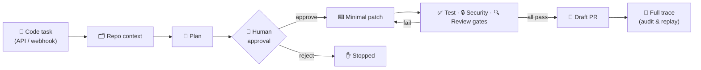
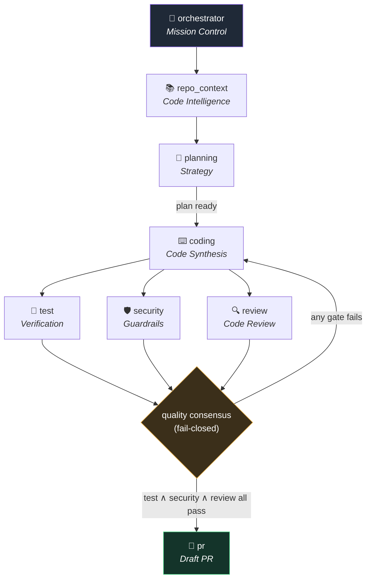
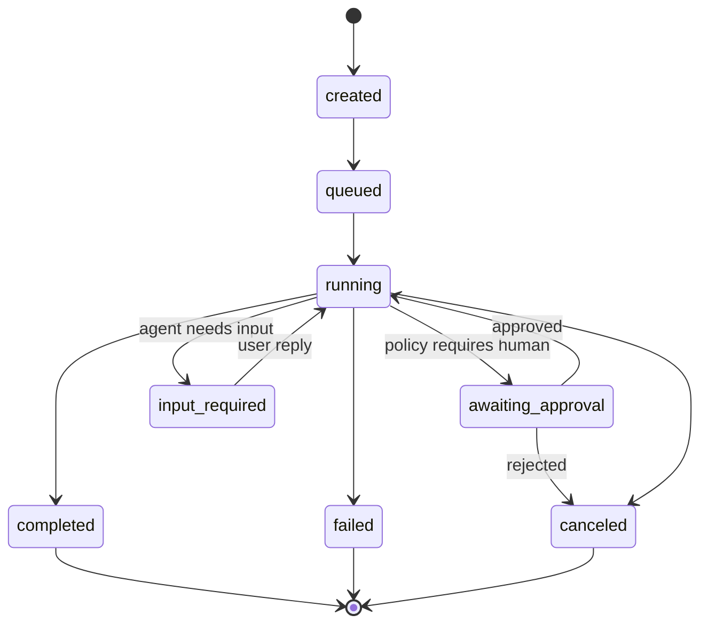
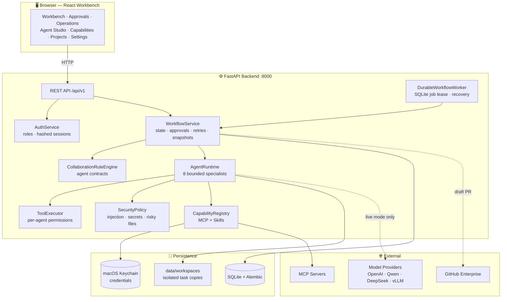

# AgentSystem

> A local-first, private multi-agent platform for enterprise code collaboration.

AgentSystem turns a natural-language request into a reviewed draft pull request by orchestrating eight specialist agents — with human approvals, deterministic quality gates, isolated workspaces, and a full auditable trace. It ships with a React operations workbench, SQLite persistence, a durable local worker, and an executable collaboration-rule engine.



Every agent runs through the same pipeline: build repository context, generate a plan, pause for human approval when policy requires it, produce a minimal patch, pass deterministic test/security/review gates, and finally open a draft PR through the GitHub Enterprise adapter (or a mock URL when no adapter credentials are configured). The entire run is recorded as a replayable trace.

## Agent Collaboration

Eight bounded specialists, each with its own model profile, tools, and contract. The `CollaborationRuleEngine` validates every entry, exit, and handoff.



Each contract defines required inputs, required outputs, allowed downstream agents, least-privilege tools, and failure ownership. Before PR packaging, **Test, Security, and Review must all report a passing result** — missing contract data, an illegal handoff, or an incomplete quality consensus fails closed with a stable error code. Workflow context is persisted with a monotonically increasing version, so an approval resumes the exact same collaboration state.

## Task Lifecycle



## Architecture



Key boundaries:

- `WorkflowService` owns deterministic state, approvals, retries, context snapshots, and recovery.
- `DurableWorkflowWorker` leases SQLite jobs and reclaims expired work after a restart.
- `CollaborationRuleEngine` enforces agent contracts and the final quality consensus.
- `AgentRuntime` executes bounded specialists and records handoff events for every run.
- `ToolExecutor` enforces per-agent tool permissions before any side effect.
- `SecurityPolicy` centralizes prompt-injection, secret, high-risk-file, and command checks.
- `CapabilityRegistry` owns MCP policy enforcement, tool discovery/invocation, Skill parsing, and per-agent capability bindings.
- `AuthService` owns local authentication, hashed sessions, role permissions, and the server-side Principal.
- API resource guards derive tenant and owner from the Principal; client-supplied identity values are ignored.
- Git projects use a temporary worktree when possible; other projects are copied under `data/workspaces`.

## Features

- **Operations workbench** — task sidebar, phase rail, live event console, artifact preview, and trace replay in one screen.
- **Approval center** — review plans and patches with full context; decisions resume the exact workflow state.
- **Operations dashboard** — task trends, success rate, per-agent cost/latency/token charts, audit log, and governance rules.
- **Command palette** — `⌘K` fuzzy search across pages, tasks, projects, and agents.
- **Per-agent model routing** — each agent has a versioned profile (provider, model, API format, Keychain credential or env-var reference, optional base URL). Switch any agent independently between **simulated** and **live** execution.
- **MCP & Skills** — register Streamable HTTP or stdio MCP servers, import local `SKILL.md` packages, bind capabilities per agent. Validation uses the official Python SDK.
- **RBAC** — `admin`, `operator`, `reviewer`, `viewer` roles with server-side permission and tenant checks.
- **Security by default** — secrets live only in macOS Keychain, never in traces, task records, API responses, or the UI. Local MCP defaults to `127.0.0.1`/`localhost`/`::1`; stdio launch is disabled by default.
- **i18n** — Chinese & English, dark & light themes.

## Tech Stack

| Layer | Technology |
|---|---|
| Backend | Python 3.12 · FastAPI · Pydantic v2 · SQLAlchemy 2 · Alembic |
| Worker | Durable SQLite-leased local worker |
| Frontend | React 19 · Vite 7 · TypeScript 5.9 · CSS Modules · TanStack Query · react-router 7 |
| Charts | recharts |
| i18n | i18next (zh / en) |
| Persistence | SQLite (WAL) |
| Secrets | macOS Keychain |
| Testing | pytest · Vitest · Testing Library · axe-core |

## Quick Start

```bash
scripts/bootstrap.sh   # install deps + apply Alembic migrations
scripts/dev.sh         # run backend (with worker) + frontend dev server
```

Open the console:

```text
http://127.0.0.1:5173/   # Vite dev server (hot reload) — proxies /api/v1 to :8000
http://127.0.0.1:8000/   # backend serving the built frontend from frontend/dist
```

> ⚠️ **Run the backend from the project root.** Paths like `frontend/dist` and `sqlite:///data/agentsystem.db` are resolved relative to the working directory. Starting it elsewhere makes the API fall back to the legacy console and creates a stray empty database.

During development use `:5173` (hot reload). For a single-process deployment, build the frontend and let the backend serve it:

```bash
npm --prefix frontend run build
scripts/start.sh
```

### Authentication modes

The default `AGENTSYSTEM_AUTH_MODE=dev` keeps local development zero-config — identity is injected by the server, not by a caller-controlled header. Set `local` to enable password login, durable sessions, and user management:

```bash
export AGENTSYSTEM_AUTH_MODE=local
export AGENTSYSTEM_BOOTSTRAP_ADMIN_USERNAME=admin
export AGENTSYSTEM_BOOTSTRAP_ADMIN_PASSWORD='replace-with-a-long-random-password'
scripts/start.sh
```

The bootstrap password is used only when the user table is empty. Passwords are stored as salted scrypt hashes; session tokens are random, stored only as SHA-256 hashes in SQLite, and delivered via an HttpOnly, SameSite=Lax cookie. Remove the bootstrap password from the environment after the first admin is created.

Roles are `admin`, `operator`, `reviewer`, and `viewer`. The server enforces permission and tenant checks for tasks, approvals, projects, traces, agent configuration, credentials, operations, audit, and user management. UI visibility is a convenience, not the security boundary.

### API examples

Headless local-auth session:

```bash
curl -sS -c /tmp/agentsystem-cookie \
  -H 'content-type: application/json' \
  -d '{"username":"admin","password":"replace-with-a-long-random-password"}' \
  http://127.0.0.1:8000/api/v1/auth/login

curl -sS -b /tmp/agentsystem-cookie http://127.0.0.1:8000/api/v1/tasks
```

Create a simulated task:

```bash
curl -sS -X POST http://127.0.0.1:8000/api/v1/tasks \
  -H 'content-type: application/json' \
  -d '{
    "repo_id": "github.example.com/acme/payments",
    "base_branch": "main",
    "prompt": "Fix the checkout retry bug and add tests",
    "workspace_path": "/path/to/your/project",
    "approval_policy": "manual_all",
    "priority": "normal"
  }'
```

Send a task-scoped agent message and approve the pending plan:

```bash
curl -sS -X POST http://127.0.0.1:8000/api/v1/tasks/<task_id>/messages \
  -H 'content-type: application/json' \
  -d '{"agent_name": "coding", "content": "请定位最可能需要修改的文件"}'

curl -sS -X POST http://127.0.0.1:8000/api/v1/approvals/<approval_id>/decisions \
  -H 'content-type: application/json' \
  -d '{"action": "approve", "comment": "Plan approved"}'
```

## Deployment

The project is designed to run split across two hosts: the React frontend is
static and deploys to Vercel, while the FastAPI backend (a long-running process
with an in-process workflow worker) deploys to Render in front of a managed
Postgres. SQLite and the embedded console are for local development only.

```text
Browser ──> Vercel (React SPA, auto-deploys from GitHub)
   │
   └── cross-origin fetch (credentials: include) ──> Render (FastAPI + worker)
                                                        └── managed Postgres
```

Frontend (Vercel): import the repo, set the Root Directory to `frontend`, and
set `VITE_API_BASE_URL` to the deployed backend origin. `frontend/vercel.json`
rewrites all routes to `index.html` for client-side routing.

Backend (Render): the included [`render.yaml`](render.yaml) Blueprint provisions
the web service and a Postgres database. It runs `alembic upgrade head` before
serving, binds to Render's injected `$PORT`, and exposes `/health` for health
checks. Create a Blueprint from the repo in the Render dashboard; you will be
prompted to set `AGENTSYSTEM_BOOTSTRAP_ADMIN_PASSWORD`, which becomes the admin
login. Key settings for the cross-origin frontend: `AGENTSYSTEM_AUTH_MODE=local`,
`AGENTSYSTEM_AUTH_COOKIE_SECURE=true`, `AGENTSYSTEM_AUTH_COOKIE_SAMESITE=none`,
and `AGENTSYSTEM_CORS_ORIGINS` set to the Vercel origin.

Note the backend is single-instance by design (it loads state into memory and
writes through to the database), so it must not be horizontally scaled. On
Render's free tier the service sleeps when idle and takes a moment to warm up.

## Project Structure

```text
agentsystem/
├── src/agentsystem/        # FastAPI backend
│   ├── api_v1.py           #   REST routes (/api/v1)
│   ├── domain.py           #   Pydantic models & enums
│   ├── workflow.py         #   WorkflowService (state machine)
│   ├── agents.py           #   AgentRuntime + 8 specialists
│   ├── collaboration.py    #   CollaborationRuleEngine
│   ├── capabilities.py     #   MCP + Skill registry
│   ├── auth.py             #   AuthService (RBAC, sessions)
│   ├── store.py            #   persistence layer
│   └── main.py             #   uvicorn entrypoint
├── frontend/               # React workbench (Vite)
│   └── src/
│       ├── pages/          #   Workbench · Approvals · Operations · …
│       ├── components/     #   CommandPalette · charts · StatusBadge · …
│       └── lib/            #   api client · fuzzy search
├── migrations/             # Alembic migrations
├── scripts/                # bootstrap / dev / start / check
├── evals/                  # local evaluation harness
├── tests/                  # pytest suite
├── docs/                   # product & architecture docs
└── design-system/          # visual design language
```

## Testing & Quality Gates

```bash
.venv/bin/python -m pytest -q      # backend tests
npm --prefix frontend test         # frontend tests (Vitest)
npm --prefix frontend run build    # production build
.venv/bin/python evals/run_local.py
```

Or run the complete local quality gate:

```bash
scripts/check.sh
```

`scripts/bootstrap.sh`, `scripts/dev.sh`, and `scripts/start.sh` apply Alembic migrations before serving. Before upgrading an important local database, stop the worker and back up `data/agentsystem.db` together with any active `-wal` file.

## Documentation

- [Documentation index](docs/README.md)
- [Product requirements](docs/product-requirements.md)
- [UI/UX design specification](docs/ux-ui-design.md)
- [Target system architecture](docs/architecture.md)
- [Development and migration plan](docs/development-plan.md)
- [Multi-Agent collaboration rules](docs/collaboration-rules.md)
- [Model provider configuration](docs/model-provider-configuration.md)
- [MCP and Skill configuration](docs/capability-configuration.md)
- [Design system](design-system/MASTER.md)
- [Refactor diagnostic](docs/refactor-diagnostic.md) · [target design](docs/refactor-target-design.md) · [implementation report](docs/refactor-implementation-report.md)

## Acknowledgements

The console layout is inspired by [ChatPilot](https://github.com/shibing624/ChatPilot) (Apache-2.0) — its persistent sidebar workbench, per-message agent routing, and chat history pattern are folded into AgentSystem's control plane while keeping AgentSystem's private code-collaboration workflow and security boundaries.
