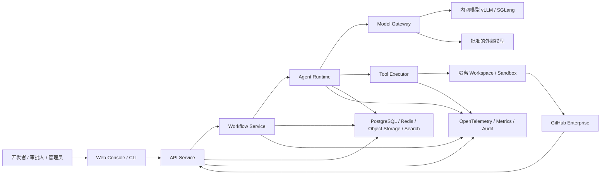
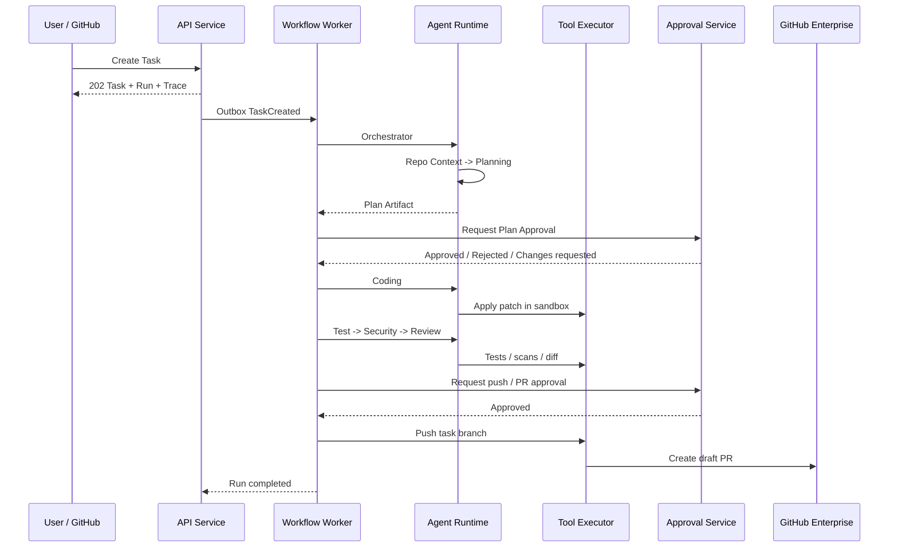

# AgentSystem 系统架构设计

版本：0.1  
状态：目标架构基线  
关联需求：[产品需求文档](product-requirements.md)

## 1. 架构目标

目标架构支持企业内网中的长时间、多步骤、可审批代码协作任务，并满足以下约束：

- 代码、密钥和敏感数据默认不离开内网。
- 工作流可恢复、可取消、可重试，副作用幂等。
- 每个 Agent 可以使用独立 provider、model、凭据引用和工具权限。
- 模型调用、工具调用、文件访问、审批、产物和 Git 操作统一审计。
- 业务逻辑不直接绑定某个模型供应商、Git 服务或 sandbox 实现。
- MVP 能以模块化单体落地，生产阶段可按边界拆分服务。

## 2. 当前架构评估

当前项目是 FastAPI 模块化原型：

- `ui.py` 内嵌约 2200 行 HTML/CSS/JavaScript，验证了产品概念，但不适合持续演进。
- `api.py` 同时承担路由、输入处理、DTO 组装和部分业务逻辑。
- `WorkflowService` 同步执行工作流；进程异常后不能恢复。
- `InMemoryStore` 适合测试，不满足持久化、并发一致性和多实例部署。
- `ModelGateway` 已建立 provider-neutral 边界，但所有调用仍是模拟响应。
- `ToolExecutor` 已建立权限检查入口，但 Git、文件写入和 PR 仍主要为模拟。
- `WorkspaceService` 支持本地目录与文件预览，但生产环境需要根目录限制和强隔离。
- `TraceRecorder` 已将多类事件绑定到 trace id，可作为生产事件模型的起点。

保留这些业务概念，重构其模块边界与运行方式，不直接在当前单文件 UI 上继续堆叠功能。

## 3. 系统上下文



## 4. 架构原则

### 4.1 模块化单体先行

MVP 使用一个代码仓库和可独立部署的 API、worker、frontend 进程，领域模块通过明确接口交互。只有在负载、隔离或团队所有权需要时再拆服务。

### 4.2 端口与适配器

领域层依赖抽象端口：`TaskRepository`、`WorkflowEngine`、`ModelProvider`、`ToolRunner`、`GitProvider`、`ArtifactStore`、`CredentialResolver`。PostgreSQL、Temporal、GitHub、Vault 和容器运行时属于适配器。

### 4.3 命令与查询分离

- 命令修改状态，必须有权限、幂等键和审计。
- 查询只读，支持分页、筛选和字段裁剪。
- 实时事件通过 SSE 或 WebSocket 推送，不能依赖高频轮询。

### 4.4 版本锁定

Task 创建时锁定工作流模板、Agent 版本、模型路由、策略版本和项目上下文版本。后续配置变更只影响新 Run。

### 4.5 默认拒绝

模型、工具、路径、网络、Git 动作和审批均遵循显式 allowlist。无法判定时拒绝或要求人工审批。

## 5. 逻辑模块

| 模块 | 职责 | 不负责 |
| --- | --- | --- |
| Identity & Access | OIDC、会话、RBAC、资源作用域 | 业务工作流 |
| Project | 项目、仓库、目录、索引、分支和项目策略 | Agent 调度 |
| Task | Task/Run/Step 生命周期、查询和用户操作 | 模型协议 |
| Workflow | 编排、重试、等待审批、补偿和恢复 | UI 展示模型 |
| Agent | Agent 定义、版本、handoff、输入输出 schema | 供应商鉴权 |
| Model Routing | provider、路由、预算、回退、调用记录 | 业务审批 |
| Tool Execution | sandbox、工具权限、命令模板、资源限制 | 工作流状态决策 |
| Approval | 审批策略、请求、原子决策、过期和升级 | 执行 Git 副作用 |
| Artifact | 计划、补丁、日志、报告、hash 和保留期 | 大内容内嵌数据库 |
| Trace & Audit | 事件、模型/工具调用、审计、回放 | 修改业务记录 |
| Integration | GitHub、通知、Issue/PR 映射 | 领域规则 |

## 6. 目标部署单元

### 6.1 Frontend

React + TypeScript 单页应用，职责包括路由、任务工作台、实时事件、设计系统和国际化。通过 OpenAPI 生成或校验 API 类型，不复制领域枚举。

### 6.2 API Service

FastAPI 负责认证授权、命令与查询 API、Webhook、SSE/WebSocket 入口和 OpenAPI。API 不在请求线程中运行长任务。

### 6.3 Workflow Worker

使用 Temporal 或实现同等语义的持久化工作流引擎。负责等待审批、定时器、重试、取消、补偿和活动编排。

### 6.4 Agent Runtime Worker

加载锁定的 Agent 版本，调用模型网关，执行 handoff 和 guardrail，并写 AgentRun/ModelCall/TraceEvent。

### 6.5 Tool Executor

独立信任域。每个任务创建 sandbox，接收已签名、已授权的工具请求；限制命令、路径、网络、CPU、内存、磁盘和时间。

### 6.6 Model Gateway

统一供应商协议、凭据解析、数据分级、脱敏、限流、预算、回退和审计。业务服务只传 credential reference，不接触密钥明文。

### 6.7 Indexer

异步解析代码、符号、依赖和 embedding，写入 OpenSearch/pgvector。索引按项目与提交版本隔离。

## 7. 前端架构

### 7.1 目录边界

```text
frontend/src/
  app/                 # 路由、providers、全局错误边界
  features/
    tasks/
    projects/
    agents/
    approvals/
    operations/
    settings/
  components/          # 业务无关可复用组件
  design-system/       # token、主题、基础组件
  api/                 # 生成类型、client、错误映射
  i18n/                # zh-CN、en-US 资源
  state/               # 仅客户端会话状态
  test/
```

### 7.2 状态管理

- 服务端状态由查询缓存管理，使用 query key 统一失效规则。
- 路由状态放在 URL：选中任务、Run、主标签和可分享筛选。
- 临时 UI 状态放本地 store：抽屉、控制台尺寸、未提交草稿。
- 任务事件从 SSE/WebSocket 合并到缓存；按 `event_id` 去重。
- 不在多个组件中复制完整 Task 对象作为可变状态。

### 7.3 前端安全

- 采用 BFF session 或安全 HttpOnly cookie，不在 localStorage 保存访问 token。
- 所有富文本使用受限 Markdown 渲染和 HTML 清洗。
- 外部链接明确标识并使用安全 `rel` 属性。
- 日志、路径、prompt 和模型输出均视为不可信内容，禁止直接注入 DOM。
- CSP 默认拒绝内联脚本；生产 UI 不继续使用单文件内嵌脚本。

## 8. 后端分层

```text
src/agentsystem/
  api/                  # HTTP/SSE/WebSocket、DTO、认证依赖
  application/          # 用例、命令、查询、事务边界
  domain/               # 实体、值对象、状态机、领域事件
  ports/                # 仓储和外部能力接口
  infrastructure/
    persistence/        # PostgreSQL、Redis
    workflow/           # Temporal
    models/             # Model Gateway client
    tools/              # Sandbox client
    git/                # GitHub Enterprise
    artifacts/          # MinIO/S3
    search/              # OpenSearch/pgvector
  observability/
```

### 8.1 事务边界

- 创建 Task 与初始 Run 在一个数据库事务中完成，并写 outbox 事件。
- 审批决策使用条件更新：只允许 `pending` 变为终态。
- Tool/Git 外部副作用使用 idempotency key；结果回写与事件通过 inbox/outbox 去重。
- 大产物先写对象存储，再以 hash 和元数据提交数据库。

### 8.2 错误模型

统一错误响应：

```json
{
  "error": {
    "code": "APPROVAL_ALREADY_DECIDED",
    "message": "该审批已处理",
    "request_id": "req_...",
    "details": {
      "approval_id": "appr_..."
    }
  }
}
```

`code` 稳定且可供前端本地化；`message` 面向人；内部堆栈只进入受限日志。

## 9. 工作流设计

### 9.1 主流程



### 9.2 执行语义

- Workflow 可重放代码只做确定性决策，不直接调用网络、文件或模型。
- 模型、工具、Git、索引和通知都是 Activity。
- Activity 默认至少一次；任何外部副作用必须使用 `task_id + run_id + step_id + attempt` 幂等键。
- 自动测试修复最多两轮，次数来自策略并记录在 Run。
- 取消通过 workflow signal 传播；Activity 在安全检查点响应取消。
- 审批等待使用 durable signal，不占用线程或轮询。

### 9.3 状态一致性

Task 是用户级聚合，Run 是执行聚合，Step 是最小状态单位。UI 不通过 AgentRun 推断 Task 真相，而读取明确的 Task/Run/Step 状态。

## 10. Agent 运行时

### 10.1 Agent 版本

发布版本包含：

- instructions 与输入输出 schema。
- 主模型路由与回退路由。
- credential reference。
- 可用工具、路径、网络和资源策略。
- 可 handoff 的 Agent、条件和上下文映射。
- guardrail、eval 版本和 Owner。

### 10.2 Handoff 合约

Handoff 不是自由文本跳转，必须包含：

```json
{
  "from_agent": "planning",
  "to_agent": "coding",
  "reason": "plan_approved",
  "input_artifact_ids": ["art_plan_..."],
  "context_version": 3,
  "expected_output_schema": "coding-result/v1"
}
```

运行时校验目标 Agent、schema、权限和上下文大小，再提交下一 Step。

### 10.3 Guardrail 顺序

1. 输入来源与 Prompt Injection 检查。
2. 数据分级与模型路由检查。
3. Agent 输出 schema 和敏感内容检查。
4. 工具调用参数与权限检查。
5. 产物、补丁和日志 secret scan。
6. 外部发送前的最终 egress 检查。

## 11. 模型网关

### 11.1 路由请求

业务侧传递：Agent 版本、任务数据级别、purpose、token/成本预算、credential reference 和 trace context。网关解析真实凭据并选择 provider adapter。

### 11.2 路由决策

优先级：

1. 安全和数据驻留策略。
2. Agent 已发布版本。
3. 项目级覆盖。
4. 健康、限流与预算。
5. 回退策略。

每次决策写 `model_route_decision` 事件，记录候选、选择和拒绝原因，不记录密钥。

### 11.3 调用记录

记录 provider、model、deployment、prompt/completion token、cost、latency、retry、cache、error、simulated 和 data_classification。Prompt/response 正文按策略选择不存、脱敏存或加密存。

## 12. Tool Executor 与 Sandbox

### 12.1 隔离

- 每个 Run 使用独立 workspace；并行 Step 使用受控子目录或快照。
- 容器默认非 root、只读基础镜像、受限 capabilities、seccomp/AppArmor 和临时文件系统。
- 网络默认关闭；企业代理按域名、端口和方法 allowlist。
- Git token、模型凭据和包仓库凭据按步骤短期挂载，用后销毁。

### 12.2 工具协议

工具使用结构化 schema，不接受任意 shell 字符串作为默认入口。测试命令来自项目已批准模板；动态参数单独校验。

工具请求包含 `tool_call_id`、Agent、Task/Run/Step、workspace、权限快照、超时和资源限额。Executor 返回退出码、结构化结果、日志 artifact 和资源使用。

### 12.3 文件访问

- 所有路径在 workspace 根目录内解析并重新验证。
- 打开文件时使用安全句柄，降低符号链接 TOCTOU 风险。
- 大文件流式读取；二进制、密钥和策略排除文件默认拒绝。
- 读写均记录文件路径摘要、大小、hash 和 actor。

## 13. 数据架构

### 13.1 PostgreSQL

核心表：

- `tenants`, `users`, `memberships`, `roles`, `permissions`
- `projects`, `repositories`, `project_policies`, `code_context_versions`
- `tasks`, `workflow_runs`, `run_steps`
- `agent_definitions`, `agent_versions`, `agent_runs`, `handoffs`
- `model_providers`, `model_routes`, `model_calls`
- `tool_calls`, `approvals`, `approval_decisions`
- `artifacts`, `trace_events`, `audit_logs`
- `integration_installations`, `webhook_deliveries`
- `outbox_events`, `inbox_events`

所有业务表包含 `tenant_id`、时间戳和版本字段；并发写使用乐观锁或条件更新。

### 13.2 Redis

仅用于短期缓存、限流、分布式协调和 SSE 会话，不作为任务状态真相来源。

### 13.3 对象存储

保存 patch、日志、测试报告、上下文包、Trace 导出和 PR 描述。数据库保存 URI、hash、大小、内容类型、分类和保留期。

### 13.4 搜索

- OpenSearch：全文代码、日志和审计搜索。
- pgvector 或向量服务：代码语义检索。
- 索引键包含 tenant/project/commit，避免跨租户召回。

## 14. API 设计

### 14.1 约定

- 统一前缀 `/api/v1`。
- 命令返回 202 或资源结果；长任务返回 Task/Run ID。
- 创建与副作用命令支持 `Idempotency-Key`。
- 列表使用游标分页：`page[after]`, `page[size]`。
- 时间使用 UTC ISO 8601；金额包含 currency；状态使用稳定枚举。
- 每个响应返回或 header 携带 `request_id`。

### 14.2 主要资源

```text
POST   /api/v1/tasks
GET    /api/v1/tasks
GET    /api/v1/tasks/{task_id}
POST   /api/v1/tasks/{task_id}/cancel
POST   /api/v1/tasks/{task_id}/runs
GET    /api/v1/tasks/{task_id}/runs/{run_id}
GET    /api/v1/tasks/{task_id}/events
POST   /api/v1/tasks/{task_id}/messages

GET    /api/v1/approvals
GET    /api/v1/approvals/{approval_id}
POST   /api/v1/approvals/{approval_id}/decisions

GET    /api/v1/projects
POST   /api/v1/projects/local-picker
GET    /api/v1/projects/{project_id}/files

GET    /api/v1/agents
POST   /api/v1/agents/{agent_id}/versions
POST   /api/v1/agents/{agent_id}/versions/{version_id}/publish

GET    /api/v1/providers
POST   /api/v1/providers/{provider_id}/health-checks
GET    /api/v1/credential-references

GET    /api/v1/traces/{trace_id}
GET    /api/v1/artifacts/{artifact_id}
POST   /api/v1/webhooks/github
```

本地目录选择器只在桌面代理或本机部署模式可用；服务器部署返回受管项目选择列表。

### 14.3 实时协议

MVP 使用 SSE：

```text
GET /api/v1/tasks/{task_id}/events?after=<event_id>
```

事件结构：

```json
{
  "id": "evt_...",
  "type": "step.started",
  "occurred_at": "2026-07-10T08:00:00Z",
  "tenant_id": "tenant_...",
  "task_id": "task_...",
  "run_id": "run_...",
  "step_id": "step_...",
  "trace_id": "trace_...",
  "actor": {"type": "agent", "id": "coding"},
  "payload": {},
  "schema_version": 1
}
```

客户端按事件 ID 去重，断线后使用最后游标恢复。

## 15. 安全架构

### 15.1 信任边界

1. 浏览器到 API：用户身份、CSRF、输入校验。
2. API/Workflow 到 Agent：版本与上下文完整性。
3. Agent 到 Model Gateway：数据分级与凭据隔离。
4. Agent 到 Tool Executor：能力授权与 sandbox 隔离。
5. Tool Executor 到 GitHub/代理：最小权限 token 与 egress allowlist。

### 15.2 关键控制

- OIDC + RBAC/ABAC；服务间 mTLS 或工作负载身份。
- Webhook HMAC/签名验证、时间窗口和 delivery 幂等。
- credential reference 由专用服务解析，业务进程不读取明文。
- Prompt 和仓库内容均视为不可信输入，不能改变系统策略。
- 任何外部发送前执行 egress policy；高敏项目禁止外部 provider。
- 审批记录 append-only；关键审计支持 WORM 存储或签名链。
- API 限流、请求大小限制、上传类型校验和病毒扫描。

## 16. 可观测性

- OpenTelemetry trace 贯穿 HTTP、workflow、Agent、model、tool、Git 和 storage。
- 指标：任务吞吐/成功率/时长、队列、审批等待、Agent 错误、模型 token/成本/延迟、工具资源、sandbox 清理。
- 日志为结构化 JSON，包含 request_id、trace_id、task_id、run_id、tenant_id 和 actor。
- 日志禁止记录 token、API key、完整 Authorization header 和未脱敏 prompt。
- Agent run replay 使用版本化事件与 artifact，不依赖临时进程内状态。

## 17. 部署拓扑

MVP 推荐 Kubernetes 或企业容器平台：

- `frontend` 静态资源。
- `api-service` 至少 2 副本。
- `workflow-worker` 与 `agent-worker` 独立扩缩。
- `tool-executor` 在隔离节点池运行。
- PostgreSQL 高可用、Redis、MinIO/S3、OpenSearch、Temporal。
- Model Gateway 位于受控网络区；外部 provider 仅经企业 egress gateway。

开发环境允许 Docker Compose 或单机进程，但使用相同端口接口和配置结构。

## 18. 架构决策记录

| ADR | 决策 | 原因 |
| --- | --- | --- |
| ADR-001 | 任务与 Run 分离 | 支持重试、历史保留和多次执行 |
| ADR-002 | MVP 使用模块化单体 | 降低早期分布式复杂度，同时保留清晰边界 |
| ADR-003 | 长任务使用持久化工作流 | 支持审批等待、恢复、定时器和补偿 |
| ADR-004 | 模型调用只经 Model Gateway | 统一安全、凭据、路由、预算和审计 |
| ADR-005 | Tool Executor 独立信任域 | 降低代码执行对控制面的风险 |
| ADR-006 | 凭据只保存引用 | 避免业务数据库和 UI 接触明文密钥 |
| ADR-007 | SSE 作为 MVP 实时协议 | 单向事件足够、实现简单、支持断线续传 |
| ADR-008 | UI 从内嵌脚本迁移到独立 TypeScript 应用 | 提升模块化、测试、CSP、安全与可维护性 |

## 19. 从当前实现迁移

| 当前模块 | 目标去向 |
| --- | --- |
| `ui.py` | `frontend/` 路由、features、design-system 和 i18n |
| `api.py` | `api/routes` + `application/commands` + `application/queries` |
| `domain.py` | 按 Task、Agent、Approval、Project、Trace 领域拆分 |
| `store.py` | Repository ports + PostgreSQL adapters |
| `workflow.py` | 持久化 workflow definitions + activities |
| `agents.py` | Agent definitions、runtime ports 和版本化配置 |
| `model_gateway.py` | Model Gateway client + provider adapters |
| `tools.py` | Tool protocol client；执行逻辑移至隔离服务 |
| `workspace.py` | Project service + desktop local-picker adapter |
| `github_adapter.py` | Git provider port + GitHub Enterprise App adapter |

迁移期间保留旧 API 兼容层，但所有新前端只使用 `/api/v1`。旧端点在新流程稳定后统一废弃。
