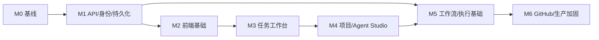

# AgentSystem 项目开发计划

版本：0.1  
状态：待评审  
输入文档：[产品需求](product-requirements.md)、[UI/UX 规格](ux-ui-design.md)、[系统架构](architecture.md)

## 1. 开发策略

采用“保留可运行 MVP，逐层替换”的方式实施：先建立契约、持久化和前端基础，再迁移任务工作台，最后启用真实模型和隔离执行。任何阶段都保持一个可演示、可测试的主流程。

不在现有 `ui.py` 中继续扩展大型功能。紧急缺陷可以修复，但新页面和新流程进入独立前端。

## 2. 目标仓库结构

```text
agentsystem/
  frontend/
    src/
    public/
    tests/
    package.json
  src/agentsystem/
    api/
    application/
    domain/
    ports/
    infrastructure/
    observability/
  workers/
    workflow/
    agent/
    indexer/
  services/
    tool-executor/
    model-gateway/
  migrations/
  tests/
    unit/
    integration/
    contract/
    security/
    e2e/
  evals/
  deploy/
    compose/
    kubernetes/
  docs/
  design-system/
```

MVP 阶段可以让 `workers` 和 `services` 仍由同一个 Python 包实现，但进程入口、端口接口和部署配置必须独立。

## 3. 里程碑

### M0 文档与工程基线

目标：建立可开发、可评审、可回归的基础。

- 冻结产品需求、UI/UX、架构和设计系统基线。
- 初始化 Git 仓库并建立分支、提交、PR 和 CODEOWNERS 规范。
- 配置 Python/TypeScript 格式化、lint、类型检查、单元测试和安全扫描。
- 建立 CI：backend、frontend、contract、security、e2e 分层执行。
- 建立 ADR、数据库迁移和 API 变更流程。

完成标准：文档评审通过；CI 在空功能分支上稳定通过；主分支受保护。

### M1 API 契约、身份与持久化

覆盖需求：IAM-001~004、TSK-001~003、OBS-001、APR-002。

- 引入 `/api/v1`、统一错误模型、request id、游标分页和幂等键。
- 接入企业 OIDC；实现租户、团队、项目、任务作用域授权。
- 将 Task、Run、Step、Approval、AgentRun、ModelCall、ToolCall、Artifact、TraceEvent、AuditLog 落入 PostgreSQL。
- 引入 Alembic 或等价迁移工具。
- 使用 outbox/inbox 处理工作流启动和外部事件。
- 为当前同步工作流增加异常终态、取消检查和原子审批，作为过渡安全修复。

完成标准：服务重启后任务和审批可查询；并发审批只有一次成功；越权测试通过。

### M2 前端基础与导航重构

覆盖需求：SYS-001~004、TSK-007、基础可访问性。

- 创建 React + TypeScript 前端。
- 实现设计 token、浅色/深色/跟随系统、中文/英文和密度设置。
- 实现全局应用框架、路由、认证状态、错误边界、通知和搜索入口。
- 建立 API client 与契约类型；禁止组件直接拼接 URL。
- 建立组件开发环境，覆盖 Button、Input、Select、Table、Badge、Tabs、Drawer、Modal、Toast、Code Viewer。
- 完成工作台、任务列表和基础空/加载/错误状态。

完成标准：375/768/1024/1440/1920 px 视觉回归通过；键盘导航和 WCAG 2.2 AA 核心检查通过。

### M3 任务工作台与实时事件

覆盖需求：TSK-003~008、AGT-001~004、APR-001~004、OBS-002~006。

- 实现新建任务三步抽屉。
- 实现任务顶部条、Run/Step 时间线、变更、测试、安全、审查、产物和 Trace 标签。
- 实现右侧 Agent roster/inspector/对话。
- 实现底部事件控制台和 SSE 断线续传。
- 实现审批证据卡、要求修改、冲突提示和统一审批中心。
- 实现任务取消、重试、重新运行和深链。

完成标准：从创建任务到计划审批、模拟补丁、测试、审查和 draft PR 的 UI 链路可用；刷新页面不丢状态。

### M4 项目、索引与 Agent Studio

覆盖需求：PRJ-001~006、AGT-005~007、MOD-001~007。

- 将本地目录选择器封装为桌面适配器，服务端增加允许根目录。
- 实现项目列表、Git 元数据、文件树、分段预览和索引健康。
- 引入代码索引 worker 与版本化 Context Package。
- 实现 Agent 配置草稿、发布、回滚和版本锁定。
- 实现模型路由、credential reference、健康检查、预算、超时和回退。
- 实现工具权限与 handoff schema 编辑器。
- 接入 eval 结果与发布门禁。

完成标准：管理员无需修改 `.env` 或源代码即可发布 Agent 版本；新任务锁定已发布版本。

### M5 持久化工作流与隔离执行

覆盖需求：TSK-002、TSK-004~005、EXE-001~006、可靠性需求。

- 接入 Temporal 或等价引擎，迁移主工作流。
- 将模型、工具、Git、索引、通知实现为幂等 Activity。
- 建立任务级 sandbox 和受控工具协议。
- 实现资源限额、无公网默认、企业代理 allowlist 和清理任务。
- secret scan 覆盖真实 patch、日志和产物。
- 完成取消、超时、重试、补偿和服务重启恢复测试。

完成标准：工作流 worker 重启后任务继续；sandbox 逃逸、路径越界和未授权网络测试全部阻断。

### M6 GitHub Enterprise 与生产加固

覆盖需求：GIT-001~004、审计、SLO 和部署要求。

- 实现 GitHub App 安装、签名 webhook、delivery 幂等和最小权限 token。
- 实现真实分支、commit、push、Check Run 和 draft PR。
- 接入 Prometheus/Grafana、OpenTelemetry、集中日志和告警。
- 完成备份恢复、容量、故障注入、升级和回滚演练。
- 完成渗透测试、供应链扫描和上线审计。

完成标准：生产验收场景 AC-01~08 全部通过，P0 缺陷为零。

## 4. 建议迭代顺序



M1 完成后，前端与工作流团队可以并行。真实模型调用只能在 credential reference、数据分级、审计和 egress 策略具备后启用。

## 5. 当前代码迁移任务

### 5.1 必须先修复的运行时风险

| 优先级 | 风险 | 开发任务 |
| --- | --- | --- |
| P0 | Agent 异常可能让任务停留在 running | 捕获异常，原子更新 Step/Run/Task 为 failed，记录稳定错误码 |
| P0 | 已取消任务的待审批记录仍可被处理 | 取消时失效审批；审批时条件检查 Task 与 Approval 状态 |
| P0 | 审批读取与更新不是原子操作 | 使用数据库条件更新或事务锁，返回 409 冲突 |
| P0 | API 缺少认证授权 | 引入身份中间件和资源级权限检查 |
| P0 | GitHub Webhook 未验证签名 | 增加签名、时间窗口和 delivery 去重 |
| P0 | 本地目录可打开任意可读路径 | 配置允许根目录，修复 symlink/TOCTOU，并按用户授权 |
| P1 | 文件预览先读全文件再截断 | 使用有上限的流式读取并独立获取大小 |
| P1 | secret scan 未覆盖真实 patch | 扫描实际 artifact 内容并阻断后续外发 |
| P1 | 测试依赖环境变量和持久目录 | 每个测试使用显式 Settings 与临时目录 |
| P1 | `ui.py` 单文件 2200+ 行 | 迁移到独立前端，不继续扩展内嵌模板 |

### 5.2 兼容策略

- 保留当前 `/tasks` 等端点作为 `legacy`，只供旧页面使用。
- 新前端只调用 `/api/v1`。
- legacy 和 v1 共用应用服务，不维护两套业务逻辑。
- 新任务读写 PostgreSQL 后，旧内存 Store 只用于单元测试 fixture。
- 功能对齐后删除旧 UI 与 legacy 端点，并提供一个发布周期的弃用告警。

## 6. 工程规范

### 6.1 Python

- Python 3.12+，完整类型标注。
- 路由只做协议转换、认证依赖和调用 application service。
- Pydantic DTO 与领域实体分离。
- 数据库操作只经 repository；领域层不导入 FastAPI、SQLAlchemy 或供应商 SDK。
- 所有外部调用有超时、取消、重试策略和 trace context。
- 禁止捕获宽泛异常后静默继续；错误必须映射稳定 code。

### 6.2 TypeScript

- 开启严格模式，不使用无理由的 `any`。
- 组件分为 design-system、shared、feature 三层。
- 服务端状态不复制到多个 store；表单使用独立 draft。
- 用户文案只来自 i18n 资源。
- 不使用 `dangerouslySetInnerHTML` 渲染模型内容。
- 事件订阅必须支持取消、去重和断线恢复。

### 6.3 API

- OpenAPI 变更通过 contract diff 检查。
- 新增字段优先向后兼容；删除/改名必须走版本或弃用期。
- 命令端点要求权限、幂等和审计。
- 查询端点支持分页、排序和过滤，不返回无界集合。
- 业务冲突使用 409，校验错误使用 422，权限使用 403，资源不存在使用 404。

### 6.4 数据库

- 所有 schema 变化使用迁移，迁移支持滚动部署。
- 关键状态更新包含期望旧状态或 version 条件。
- JSONB 只存扩展元数据，不代替核心关系字段。
- 审计与事件 append-only；大正文进入对象存储。
- 所有 tenant 数据查询强制 tenant filter，优先使用数据库级隔离措施。

## 7. 测试策略

### 7.1 测试分层

| 层级 | 目标 | 示例 |
| --- | --- | --- |
| 单元 | 状态机、策略、路由和纯领域逻辑 | 审批终态、模型回退、工具权限 |
| 组件 | UI 组件状态与可访问性 | Button loading、Table keyboard、Drawer focus |
| 集成 | 数据库、对象存储、Temporal、Gateway adapter | 原子审批、outbox、断线续传 |
| Contract | OpenAPI、事件 schema、GitHub payload | 前后端兼容、事件版本 |
| E2E | 关键用户旅程 | 本地项目到计划审批；Issue 到 draft PR |
| 安全 | 越权、注入、路径、secret、sandbox、egress | 跨租户读取、symlink、命令注入 |
| Evals | Agent 质量和安全行为 | 文件定位、补丁最小性、拒绝越权 |
| 可靠性 | 重启、并发、超时、重试、恢复 | worker kill、重复 webhook、审批竞争 |

### 7.2 必须自动化的场景

- 相同 idempotency key 不创建重复任务或 PR。
- 两名审批人并发提交只有一个决策成功。
- 取消任务后审批、模型、工具和 Git 副作用不会继续。
- 任一 Agent 异常都将 Step/Run/Task 置为可解释终态。
- 模型配置与 Trace 不返回真实密钥。
- 外部 provider 不接收高敏项目上下文。
- 工具不能读取 workspace 外文件或访问未批准网络。
- SSE 重连从最后事件继续且不重复渲染。
- 中英文、浅深主题、200% 缩放无布局破坏。

### 7.3 覆盖率门槛

- 领域状态机、安全策略、权限与审批分支 >= 90%。
- 其他关键后端模块 >= 80%。
- 前端核心交互使用组件测试和 E2E 覆盖，不以行覆盖率替代行为验证。
- 每个已修复生产缺陷必须添加回归测试。

## 8. Agent Evals

评估集至少包含：

- 代码定位准确率。
- Context Package 相关性与敏感内容过滤。
- 计划完整性、风险识别和预期改动范围。
- Patch 可应用性、最小性、正确性和风格一致性。
- 测试选择、失败解释和修复成功率。
- 安全问题召回率与误报率。
- Review 严重级别准确性和测试缺口发现率。
- 拒绝越权工具、敏感外发和 Prompt Injection 的成功率。

Agent 版本发布报告必须记录评估集版本、模型、参数、得分、成本和与当前生产版本的差异。

## 9. CI/CD 门禁

Pull Request 必须通过：

1. 格式化、lint 和类型检查。
2. 单元、组件、集成和 contract 测试。
3. 依赖、secret、SAST 和许可证扫描。
4. 数据库迁移向前/回滚或兼容性检查。
5. OpenAPI 与事件 schema breaking-change 检查。
6. 关键页面视觉回归和可访问性检查。
7. 受影响 Agent 的最小 eval 集。

主分支发布使用不可变镜像、SBOM、签名和环境审批。生产数据库迁移采用 expand/migrate/contract 顺序。

## 10. 可观测性与 SLO

### 10.1 必备指标

- API 请求量、错误率、P50/P95/P99 延迟。
- Task/Run 创建、成功、失败、取消和各阶段耗时。
- Workflow queue 与 Activity 重试。
- 审批等待时长与过期数量。
- Agent 运行、handoff、错误和 eval 版本。
- 模型 token、成本、限流、超时和回退。
- 工具调用、拒绝、资源使用和 sandbox 清理。
- SSE 连接、重连和事件滞后。

### 10.2 告警

- 任务状态长时间无进展。
- 未授权工具调用或 egress 尝试。
- secret scan 命中且外发动作仍被请求。
- Model Gateway、GitHub、Temporal、数据库或对象存储不可用。
- sandbox 清理失败和磁盘水位过高。
- 审批积压超过团队阈值。

## 11. 安全开发检查

- Threat model 覆盖浏览器、API、Prompt、模型、工具、sandbox、Git 和供应链。
- 任何新增工具先定义 schema、权限、危险级别、审批规则和审计字段。
- 任何新增 provider 先定义数据驻留、凭据、日志、超时和删除策略。
- 模型输出永远不能直接作为 shell、路径、SQL 或 HTTP 目标使用。
- 测试数据不使用真实客户代码、token 或凭据。
- 安全缺陷分级与修复 SLA 纳入发布门禁。

## 12. Definition of Done

功能只有在以下条件全部满足时才算完成：

- 关联一个或多个需求编号，并满足验收标准。
- 产品文案已进入中英文资源。
- 深浅主题、键盘、错误、空状态和加载状态完成。
- API、权限、幂等、审计和错误码已实现。
- 单元/组件、集成和必要 E2E 测试通过。
- 日志、指标和 trace 足以定位失败。
- 无明文密钥、无越权访问、无未批准外联。
- 文档、OpenAPI、迁移和运维说明同步更新。
- 代码由对应 Owner 审查，安全敏感变更由安全 Owner 加审。

## 13. 风险与缓解

| 风险 | 影响 | 缓解 |
| --- | --- | --- |
| 同时重写前端、工作流和执行层 | 周期过长、难以验收 | 按 M1-M6 渐进替换，每阶段保留可运行主流程 |
| 模型行为不稳定 | 补丁和审查质量波动 | 版本锁定、结构化输出、eval、回退和人工审批 |
| 工具执行扩大攻击面 | 代码和基础设施受损 | 独立信任域、allowlist、sandbox、无公网和短期凭据 |
| 多租户数据泄露 | 严重合规问题 | tenant filter、数据库隔离、授权测试和审计 |
| 事件与数据库状态不一致 | UI 错误、重复副作用 | outbox/inbox、幂等、版本字段和定期对账 |
| 设计系统被绕过 | UI 再次碎片化 | token lint、组件库、Storybook 和视觉回归门禁 |

## 14. 第一批开发 Backlog

建议从以下可独立合并的任务开始：

1. `FOUND-001` 初始化 Git、CI、代码质量和文档检查。
2. `BACK-001` 引入统一错误模型与 request id。
3. `BACK-002` 修复异常终态、取消后审批和并发审批。
4. `DATA-001` 建立 PostgreSQL schema 与迁移骨架。
5. `API-001` 建立 `/api/v1/tasks` 契约与 idempotency key。
6. `FRONT-001` 初始化 TypeScript 前端和设计 token。
7. `FRONT-002` 实现应用框架、主题、语言和路由。
8. `FRONT-003` 实现任务列表与标准状态组件。
9. `REALTIME-001` 定义事件 schema 并实现 SSE 原型。
10. `SEC-001` 引入允许项目根目录和安全文件读取。

每个 Backlog 项应在 Issue 中附上需求编号、用户场景、接口/设计链接、验收测试和安全影响。
