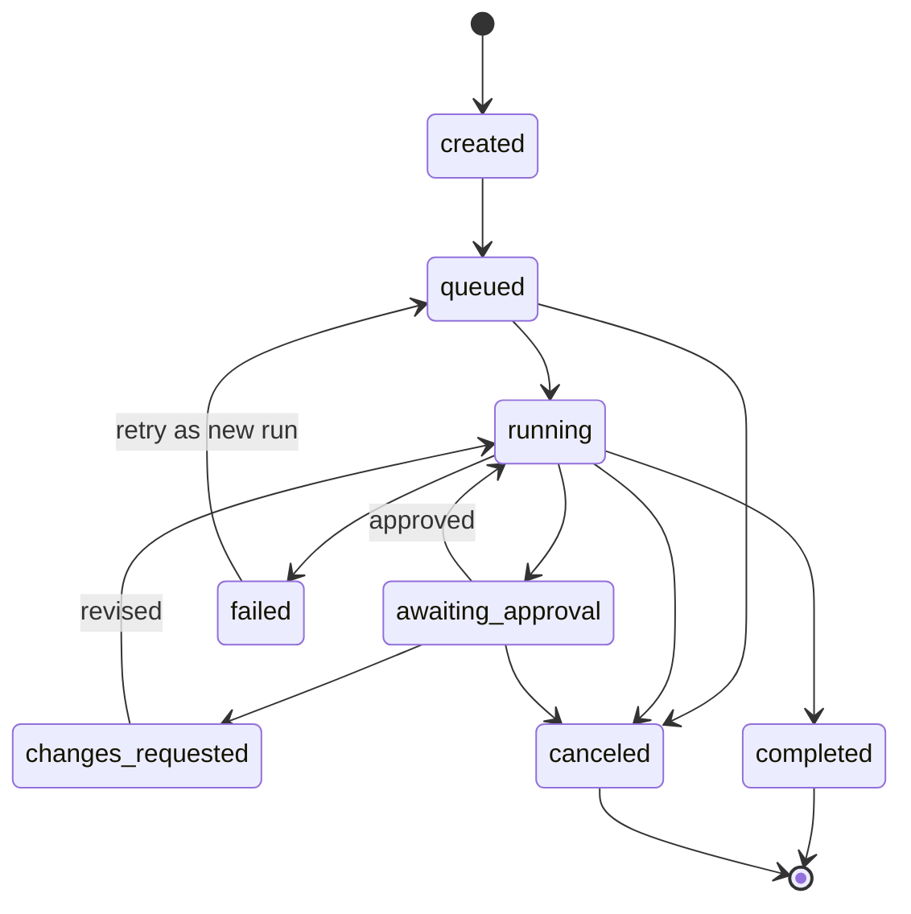

# AgentSystem 产品需求文档

版本：0.1  
状态：需求基线  
更新时间：2026-07-10

## 1. 产品定义

AgentSystem 是部署在企业内网的多 Agent 代码协作平台。它把需求、代码上下文、Agent 协作、模型路由、工具执行、人工审批、测试审查和 GitHub Enterprise PR 串成一个可追踪、可中断、可恢复的工作流。

产品不以“聊天机器人”为中心，而以“可治理的代码任务”为中心。对话是任务中的协作入口；计划、补丁、测试、审批、审查和审计记录才是可交付结果。

## 2. 背景与问题

当前 MVP 已具备任务、工作区、Agent 状态、模型配置、审批、产物、对话和 Trace 的基本入口，但仍存在以下产品问题：

- 页面按照技术模块拆分，用户完成一次任务需要频繁切换页面。
- 任务创建、执行状态、审批、产物和对话没有形成连续工作区。
- 模拟调用与真实调用的区分不够突出，容易造成信任误判。
- Agent 只展示静态状态，缺少目标、当前动作、输入输出、工具调用和 handoff 的统一视图。
- 本地项目可以浏览，但项目索引、仓库授权、分支和任务之间的关系不够明确。
- 配置以 provider/model/API key 环境变量为核心，尚未形成企业级凭据、路由、预算和回退策略。
- 运行数据以内存保存，无法满足生产环境的恢复、并发、审计和多租户要求。
- API 缺少统一版本、认证授权、幂等、分页、错误模型和实时事件规范。

## 3. 产品目标

### 3.1 业务目标

1. 让研发人员在一个任务工作台内完成“选项目、提需求、看计划、批审批、跟执行、查产物、开 PR”。
2. 让平台管理员能够独立配置每个 Agent 的模型、凭据引用、工具权限、预算和回退策略。
3. 让审批人能够基于明确证据快速判断计划、高风险改动、推送和 PR 创建。
4. 让安全与审计人员能够追溯任何模型调用、工具调用、文件访问、审批和外部集成动作。
5. 在代码不默认离开内网的前提下，允许企业通过策略网关接入已批准的外部模型。

### 3.2 用户体验目标

- 新用户在 5 分钟内完成项目选择并创建第一个任务。
- 常规任务从打开详情到找到当前阻塞原因不超过 10 秒。
- 审批人无需查看原始日志即可理解“为什么需要审批、将发生什么、风险在哪里”。
- 任一运行状态都能回答：谁在执行、执行什么、用了哪个模型、调用了什么工具、下一步是什么。
- 所有危险操作在执行前展示影响范围，并留下不可抵赖的审批记录。

### 3.3 成功指标

| 指标 | MVP 目标 | 生产目标 |
| --- | --- | --- |
| 任务成功进入 draft PR 的比例 | >= 60% | >= 80% |
| 自动测试通过率 | >= 70% | >= 85% |
| 人工审批中位响应时间 | 可观测 | <= 30 分钟 |
| 任务失败原因可解释率 | 100% | 100% |
| 未授权工具调用 | 0 | 0 |
| 明文密钥进入日志或 Trace | 0 | 0 |
| 任务状态恢复成功率 | 不适用 | >= 99.9% |
| 核心页面可用性 | WCAG 2.2 AA | WCAG 2.2 AA |

## 4. 用户与权限

| 角色 | 主要职责 | 核心权限 |
| --- | --- | --- |
| 开发者 | 创建任务、补充上下文、查看产物、参与 Agent 对话 | 访问授权项目；创建、取消本人任务；下载非敏感产物 |
| 审批人 | 审批计划、高风险变更、分支推送和 PR 创建 | 查看审批证据；批准、拒绝、要求修改 |
| 安全审查员 | 管理高风险规则、查看安全报告和越权事件 | 查看全量安全 Trace；维护安全策略；强制终止任务 |
| 团队管理员 | 管理团队项目、Agent 模板、审批策略和成员 | 团队范围配置与授权，不可读取凭据明文 |
| 平台管理员 | 管理 provider、模型网关、凭据引用、租户与系统健康 | 全局配置、运维和审计；不默认获得项目代码访问权 |
| 审计员 | 检查历史任务、审批和调用记录 | 只读访问审计数据与导出能力 |

权限模型采用租户、组织、项目、任务四级作用域；默认拒绝，显式授权。管理员身份不自动绕过代码仓库权限。

## 5. 产品范围

### 5.1 MVP 范围

- GitHub Enterprise 单组织、多仓库。
- 本地项目目录和受管 Git 仓库两种项目来源。
- 代码修改类任务：Issue/表单 -> 计划 -> 审批 -> 补丁 -> 测试 -> 安全审查 -> 代码审查 -> draft PR。
- 八个内置 Agent：Orchestrator、Repo Context、Planning、Coding、Test、Security、Review、PR。
- 每个 Agent 独立 provider、model、凭据引用、Base URL、调用模式和工具权限。
- 计划、高风险改动、分支推送、PR 创建四类审批。
- 实时 Agent 事件、模型调用、工具调用、产物和 Trace 查看。
- 中文、英文；浅色、深色、跟随系统。
- OIDC 登录、基于角色的授权和签名 GitHub Webhook。

### 5.2 Phase 2

- 多组织、多租户资源隔离和配额。
- 自定义 Agent、工作流模板和条件分支。
- 多模型并行、自动回退、A/B 路由和预算优化。
- Jira、GitLab、自建 Git 服务和企业消息通知。
- 语义代码索引、知识库、长期记忆和跨任务复用。
- Agent eval 数据集、回归对比和版本发布门禁。
- 任务批量操作、定时任务和 API 自动化。

### 5.3 暂不纳入

- 自动合并到受保护分支。
- 绕过企业审批策略的全自动生产发布。
- 在浏览器中提供完整 IDE 替代能力。
- 在产品数据库中存储明文模型 API key。
- 默认允许工具执行访问公网。
- 未经审批向外部模型发送敏感代码。

## 6. 核心用户旅程

### 6.1 从本地项目创建任务

1. 用户进入“项目”，选择本机文件夹。
2. 系统验证目录、识别 Git 信息、语言和依赖，并展示将被索引的范围。
3. 用户从项目页或全局“新建任务”打开任务抽屉。
4. 用户输入需求，确认基础分支、审批策略和执行模式。
5. 系统创建 Task 和 Run，进入任务工作台。
6. Repo Context Agent 生成上下文包，Planning Agent 生成计划。
7. 若策略要求，任务进入计划审批；审批通过后继续执行。

### 6.2 从 GitHub Enterprise Issue 创建任务

1. GitHub App 接收签名 webhook。
2. 系统校验组织、仓库、事件类型和 delivery id 幂等性。
3. 系统将 Issue 内容、标签、评论和分支规则转换为任务上下文。
4. 用户在控制台收到新任务通知并进入工作台。
5. 后续流程与本地项目一致，最终创建 draft PR 并回写 Issue。

### 6.3 观察 Agent 协作

1. 任务工作台持续显示当前阶段、活跃 Agent、阻塞和下一步。
2. 用户选择任一 Agent，查看其目标、模型、输入摘要、输出摘要、工具调用和 handoff。
3. 用户可以向指定 Agent 发送补充指令；消息成为当前任务的版本化上下文。
4. 涉及计划或范围改变时，系统创建“变更建议”，由 Orchestrator 评估是否重新规划或重新审批。

### 6.4 处理审批

1. 审批中心和任务工作台同时展示待审批项。
2. 审批详情必须包含原因、影响文件、diff 摘要、测试结果、风险等级和即将执行的动作。
3. 审批人可以批准、拒绝或要求修改，并填写意见。
4. 决策提交后不可覆盖；修正必须产生新的审批记录。
5. 过期或已取消任务的审批不可继续执行。

### 6.5 配置 Agent 模型

1. 管理员进入“Agent Studio”，选择 Agent 和配置版本。
2. 设置 provider、model、credential reference、Base URL、超时、预算和回退路由。
3. 系统执行连通性与权限检查，结果不暴露凭据。
4. 管理员保存草稿、执行评估、发布版本。
5. 新任务使用已发布版本；运行中的任务继续使用创建时锁定的版本。

## 7. 功能需求

优先级定义：`P0` 为 MVP 阻断项，`P1` 为 MVP 完整体验，`P2` 为后续增强。

### 7.1 身份、租户与权限

| 编号 | 优先级 | 需求 | 验收标准 |
| --- | --- | --- | --- |
| IAM-001 | P0 | 通过企业 OIDC 登录并建立用户会话 | 未登录请求返回 401；会话过期可重新认证；不记录 token 明文 |
| IAM-002 | P0 | 基于角色和资源作用域授权 | 每个 API 执行租户、项目和动作校验；越权返回 403 并写审计日志 |
| IAM-003 | P0 | 项目权限与 GitHub Enterprise 权限一致 | 用户不能通过平台访问其无权访问的仓库、分支或 PR |
| IAM-004 | P1 | 管理员可查看成员、角色和最近活动 | 列表支持搜索、分页和角色过滤；敏感信息脱敏 |

### 7.2 项目与代码上下文

| 编号 | 优先级 | 需求 | 验收标准 |
| --- | --- | --- | --- |
| PRJ-001 | P0 | 通过系统目录选择器打开本地项目 | 不要求手输绝对路径；取消选择不会改变当前项目 |
| PRJ-002 | P0 | 限制可访问的项目根目录 | 服务端只允许管理员配置的根目录；路径穿越与符号链接越界被拒绝 |
| PRJ-003 | P0 | 展示项目元数据 | 显示 Git 状态、远端、默认分支、语言、依赖、索引状态和最后更新时间 |
| PRJ-004 | P0 | 浏览和预览允许的文本文件 | 大文件分段读取；二进制和敏感文件有明确提示；访问产生审计事件 |
| PRJ-005 | P1 | 创建版本化代码上下文包 | 包含相关文件、符号、依赖、Issue 和检索证据；可关联到具体 Run |
| PRJ-006 | P1 | 管理项目级策略 | 可设置分支、风险文件、测试命令、网络和模型数据分级策略 |

### 7.3 任务与工作流

| 编号 | 优先级 | 需求 | 验收标准 |
| --- | --- | --- | --- |
| TSK-001 | P0 | 创建代码协作任务 | 必填项目、需求和基础分支；返回 task id、run id、trace id |
| TSK-002 | P0 | 任务异步执行且可恢复 | API 不阻塞长任务；服务重启后运行状态可恢复；步骤幂等 |
| TSK-003 | P0 | 展示任务状态和当前阻塞 | 状态、当前阶段、活跃 Agent、下一步和失败原因在详情首屏可见 |
| TSK-004 | P0 | 取消任务 | 停止后续步骤、撤销未使用临时凭据并清理 workspace；待审批项失效 |
| TSK-005 | P0 | 对失败步骤进行受控重试 | 支持从安全检查点重试；保留原 Run；创建新 attempt |
| TSK-006 | P1 | 复制、重新运行和基于历史任务新建 | 新任务引用来源，但不覆盖原始记录 |
| TSK-007 | P1 | 搜索、筛选、排序和分页 | 支持状态、项目、创建人、时间、优先级和 Agent 过滤 |
| TSK-008 | P1 | 为任务增加标签、负责人和关注人 | 变更有权限校验并写审计日志 |

### 7.4 Agent 协作

| 编号 | 优先级 | 需求 | 验收标准 |
| --- | --- | --- | --- |
| AGT-001 | P0 | 展示所有 Agent 的实时状态 | 至少区分空闲、排队、运行、等待审批、成功、失败、取消、跳过 |
| AGT-002 | P0 | 展示 Agent 当前目标和最近输出 | 输出与 task/run/step 关联；长内容可展开；敏感内容脱敏 |
| AGT-003 | P0 | 记录 handoff | 显示来源、目标、条件、上下文摘要和时间；可从 Trace 回放 |
| AGT-004 | P0 | 向指定 Agent 发送任务内消息 | 消息有发送者、Agent、时间和上下文版本；不绕过审批与工具策略 |
| AGT-005 | P1 | Agent 配置版本化 | 草稿、已发布、已归档状态明确；任务锁定配置版本 |
| AGT-006 | P1 | 配置工具和文件权限 | 使用 allowlist；权限变化需管理员权限并写审计日志 |
| AGT-007 | P2 | 自定义 Agent 与工作流模板 | 模板发布前必须通过 schema 校验和 eval 门禁 |

### 7.5 模型、Provider 与凭据

| 编号 | 优先级 | 需求 | 验收标准 |
| --- | --- | --- | --- |
| MOD-001 | P0 | 每个 Agent 绑定独立 provider/model | 配置可独立保存、验证、版本化；任务记录实际使用版本 |
| MOD-002 | P0 | 只保存 credential reference | API、数据库、日志、Trace 和 UI 均不返回明文 API key |
| MOD-003 | P0 | 明确模拟与真实调用模式 | 全局环境、Agent 配置和每次调用均显示模式；模拟模式不可产生外部请求 |
| MOD-004 | P0 | 统一模型网关 | 业务代码不直接依赖供应商 SDK；所有调用经过策略、脱敏、限流和审计 |
| MOD-005 | P1 | 模型健康检查 | 显示连通性、鉴权、延迟、最近错误和检查时间，不回显敏感响应 |
| MOD-006 | P1 | 配置预算、超时和回退 | 达到预算或超时按策略停止或回退；事件中记录决策原因 |
| MOD-007 | P1 | 数据分级路由 | 按项目、文件敏感级别和任务类型限制可用 provider |

### 7.6 工具执行与安全

| 编号 | 优先级 | 需求 | 验收标准 |
| --- | --- | --- | --- |
| EXE-001 | P0 | 每个任务使用隔离 workspace | 任务间文件、进程和凭据不可见；任务结束按保留策略清理 |
| EXE-002 | P0 | 工具调用执行最小权限策略 | Agent、工具、命令模板、路径、网络和资源限额均需授权 |
| EXE-003 | P0 | 默认禁用公网 | 依赖下载只能通过企业代理和 allowlist；每次外联可审计 |
| EXE-004 | P0 | 高风险文件和命令触发审批或拒绝 | 风险原因、匹配规则和影响范围对审批人可见 |
| EXE-005 | P0 | 补丁、日志和产物执行 secret scan | 扫描覆盖真实生成内容；发现密钥后阻断外发和 PR 创建 |
| EXE-006 | P1 | 限制 CPU、内存、磁盘和运行时间 | 超限时终止步骤并给出可解释错误；资源使用可观测 |

### 7.7 审批与治理

| 编号 | 优先级 | 需求 | 验收标准 |
| --- | --- | --- | --- |
| APR-001 | P0 | 支持计划、高风险变更、推送和 PR 创建审批 | 每种审批有独立策略、证据模板、审批角色和有效期 |
| APR-002 | P0 | 审批决策原子化且不可覆盖 | 并发提交只有一次成功；取消或过期任务不能继续审批 |
| APR-003 | P0 | 支持批准、拒绝和要求修改 | “要求修改”生成新步骤和新审批；原记录保持不变 |
| APR-004 | P1 | 提供统一审批中心 | 支持按团队、项目、风险和等待时间筛选；可从通知深链进入 |
| APR-005 | P1 | 审批委托与升级 | 委托有时间范围；超时可升级；全过程审计 |

### 7.8 产物、Trace 与审计

| 编号 | 优先级 | 需求 | 验收标准 |
| --- | --- | --- | --- |
| OBS-001 | P0 | 统一 trace id 串联全部事件 | Task、Run、Step、Agent、模型、工具、审批和产物均可按 trace 查询 |
| OBS-002 | P0 | 实时事件流 | 断线重连不重复丢失事件；支持事件游标和历史回放 |
| OBS-003 | P0 | 产物可查看、下载和校验 | 记录类型、大小、hash、创建者和保留期；权限与项目一致 |
| OBS-004 | P0 | 审计日志不可被普通用户修改 | 审计事件包含 actor、action、resource、result、time 和 correlation id |
| OBS-005 | P1 | 展示成本、token、延迟和错误 | 支持按任务、Agent、模型、项目和时间聚合；模拟数据明确标记 |
| OBS-006 | P1 | 导出审计和运行报告 | 导出过程有权限、脱敏和审计；大导出异步生成 |

### 7.9 GitHub Enterprise 集成

| 编号 | 优先级 | 需求 | 验收标准 |
| --- | --- | --- | --- |
| GIT-001 | P0 | 校验 Webhook 签名和 delivery id | 签名无效拒绝；重复 delivery 不重复创建任务 |
| GIT-002 | P0 | 使用最小权限短期 token | token 仅绑定仓库和任务，过期后不可使用，不写日志 |
| GIT-003 | P0 | 创建临时分支和 draft PR | 仅审批后推送；PR 包含摘要、测试、安全、风险和 Trace 链接 |
| GIT-004 | P1 | 回写 Issue/Check Run 状态 | 状态与任务一致；失败回写包含可恢复建议，不暴露内部敏感信息 |

### 7.10 系统设置与国际化

| 编号 | 优先级 | 需求 | 验收标准 |
| --- | --- | --- | --- |
| SYS-001 | P0 | 支持中文和英文 | 所有用户可见文案通过资源文件管理；切换后无需重新登录 |
| SYS-002 | P0 | 支持浅色、深色和跟随系统 | 主题持久化；首次访问遵循系统；两套主题均满足对比度 |
| SYS-003 | P1 | 系统健康与集成状态 | 展示 API、数据库、队列、对象存储、模型网关和 GitHub 状态 |
| SYS-004 | P1 | 管理通知偏好 | 支持任务失败、待审批、完成和预算告警；按用户和项目配置 |

## 8. 业务状态模型

### 8.1 Task 状态

Task 保存业务生命周期；Run 保存每次执行。失败任务重试时创建新 Run，不覆盖旧 Run。

### 8.2 Agent Step 状态

`pending -> queued -> running -> succeeded | failed | canceled | skipped`。

等待人工输入不是 Agent 自身状态，而是工作流中的 `approval` 或 `input_required` Step。UI 可以将相关 Agent 标记为“等待审批”，但数据层必须保留真实状态。

### 8.3 Approval 状态

`pending -> approved | rejected | changes_requested | expired | canceled`。

任何终态不可回退。重新审批必须新建记录，并通过 `supersedes_approval_id` 关联前一条记录。

## 9. 非功能需求

### 9.1 安全与合规

- 代码与敏感数据默认不离开企业网络。
- 所有外部模型调用经过企业模型网关、数据分级、脱敏和审批策略。
- 静态密钥存放在 Vault/KMS/企业密钥服务中，业务数据库只保存引用。
- 传输使用 TLS；数据库、对象存储、搜索索引和备份启用静态加密。
- 所有入口执行认证授权；Webhook 使用签名；服务间使用工作负载身份。
- 防护覆盖 Prompt Injection、secret 泄露、路径穿越、命令注入、SSRF、越权工具调用和 sandbox 逃逸。
- 审计保留期、产物保留期和删除策略可按租户配置。

### 9.2 性能

- 常规列表 API P95 <= 500 ms，不含外部依赖。
- 任务详情首屏 P95 <= 1 s；事件从服务产生到 UI 可见 P95 <= 2 s。
- 列表默认分页 50 条；事件和日志使用游标分页。
- 大于 1 MB 的日志与产物不内嵌在任务详情响应中。
- 代码树、事件流和长列表必须虚拟化或增量加载。

### 9.3 可靠性

- API 服务目标可用性 99.9%。
- 工作流步骤至少一次执行，副作用通过幂等键实现业务上的恰好一次效果。
- 服务重启、节点迁移和网络短暂中断不会丢失已提交审批和任务状态。
- 外部依赖失败采用受控重试、退避、熔断和清晰失败原因。
- 所有清理操作可重试，并有孤儿 workspace 定期回收任务。

### 9.4 可用性与可访问性

- 符合 WCAG 2.2 AA。
- 所有核心操作支持键盘；焦点顺序与视觉顺序一致。
- 正文和表单文本不小于 14 px；移动输入不小于 16 px；触控目标至少 44 x 44 px。
- 状态不能只用颜色表达，必须同时提供图标或文本。
- 支持缩放 200%、减少动画和高对比度使用场景。

### 9.5 可维护性

- 前端、API、应用服务、领域模型和基础设施适配器边界清晰。
- OpenAPI 是接口契约来源；前端类型由契约生成或校验。
- 状态值、事件类型、错误码和权限动作集中定义。
- 数据库变更必须通过迁移；配置变更必须版本化；Agent 发布必须可回滚。
- 关键模块目标单元测试覆盖率 >= 80%，安全策略和状态机分支覆盖率 >= 90%。

## 10. 验收场景

### AC-01 首个本地任务

给定已登录开发者和允许访问的本地根目录，当用户选择项目并提交需求时，系统创建 Task/Run/Trace，展示上下文与计划，且用户无需输入绝对路径。

### AC-02 计划审批

给定 `manual_plan` 策略，当 Planning 完成时，任务停止在计划审批；审批卡展示计划、预期文件和测试策略；批准后只继续一次 Coding 步骤。

### AC-03 取消与过期审批

给定待审批任务，当用户取消任务后，审批变为 canceled；任何后续批准请求均返回冲突，不会恢复工作流。

### AC-04 Agent 模型隔离

给定两个 Agent 使用不同 provider/model/credential reference，当任务执行时，两次模型调用记录各自配置，任何 API 和 Trace 都不包含凭据明文。

### AC-05 模拟模式

给定系统处于模拟模式，当用户创建任务或发送 Agent 消息时，不产生外部网络调用；UI 顶部、Agent 详情和调用记录均显示“模拟”。

### AC-06 高风险文件

给定补丁修改 `.github/workflows/`，当 Security 完成扫描时，任务进入高风险审批；审批前不能推送分支或创建 PR。

### AC-07 失败恢复

给定测试步骤失败并耗尽自动修复次数，当用户选择重试时，系统创建新 Run，从允许的检查点开始，旧 Run 与日志保持可查。

### AC-08 Trace 回放

给定已完成任务，当审计员打开 Trace 时，可以按时间顺序查看 Agent、模型、工具、审批、产物和 GitHub 动作，并使用同一 trace id 关联。

## 11. 依赖与假设

- 企业提供 OIDC 身份源、GitHub Enterprise App、对象存储、PostgreSQL 和凭据管理服务。
- 模型网关提供统一的 OpenAI-compatible 或内部协议适配层。
- 生产执行环境可以创建容器或等价的强隔离 sandbox。
- 本地文件夹模式只用于受信桌面部署；服务器部署必须使用受管仓库或受限根目录。
- 当前代码目录不是 Git 仓库，因此分支、PR 和差异流程只能作为目标能力与模拟流程验证。

## 12. 发布判定

MVP 上线前必须同时满足：

- 所有 P0 需求验收通过。
- 未授权工具调用、明文密钥泄露和越权项目访问为零。
- 任务、审批和副作用操作通过并发与幂等测试。
- 关键流程完成无障碍键盘测试和中英文回归测试。
- 服务重启恢复、备份恢复和 sandbox 清理演练通过。
- 安全、平台、研发和产品负责人共同签署上线检查单。
