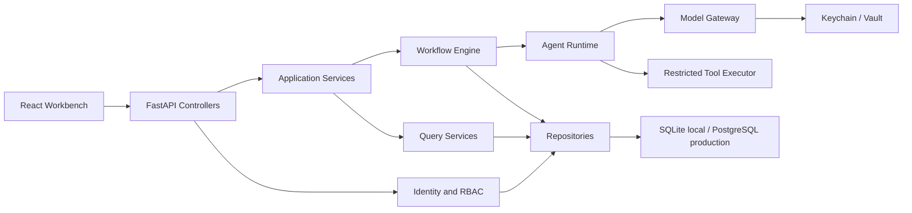

# AgentSystem 目标产品与实施设计

## 1. 产品定位

AgentSystem 是企业研发团队的私有 AI 代码协作控制台：把需求转化为可审批、可恢复、可审计的多 Agent 任务，并在隔离工作区内产出补丁、测试、安全审查和 PR 材料。

首要用户价值：

- 开发者：让重复的代码理解、修改和验证形成可控流水线。
- 审查者：集中处理计划、高风险变更和 PR 审批，看到完整证据。
- 平台运营者：管理 Agent 模型、凭据、预算和运行健康。
- 管理员：管理用户、角色、租户策略和审计记录。

## 2. 角色与权限

| 权限 | Admin | Operator | Reviewer | Viewer |
| --- | --- | --- | --- | --- |
| 查看本租户任务/项目/Trace | 是 | 是 | 是 | 是 |
| 创建、重跑、取消任务 | 是 | 是 | 否 | 否 |
| 发送 Agent 协作消息 | 是 | 是 | 是 | 否 |
| 处理审批 | 是 | 是 | 是 | 否 |
| 选择/注册本地项目 | 是 | 是 | 否 | 否 |
| 修改 Agent/模型/凭据 | 是 | 否 | 否 | 否 |
| 查看运营指标和审计 | 是 | 是 | 是（只读） | 否 |
| 管理用户和角色 | 是 | 否 | 否 | 否 |

所有资源访问先验证会话，再验证 tenant，最后验证 action permission。客户端不再决定 actor、tenant 或 owner。

## 3. 目标模块边界

本地 MVP 维持模块化单体和同进程 worker。Controller 只做输入、权限和响应映射；业务状态迁移留在 application/workflow service；查询和聚合不再依赖前端全量计算。

## 4. 身份与会话设计

- `AGENTSYSTEM_AUTH_MODE=dev`：保持本地零配置体验，由服务端注入固定管理员 Principal；不再读取用户身份请求头。
- `AGENTSYSTEM_AUTH_MODE=local`：用户名/密码登录；密码使用标准库 scrypt + 独立 salt；随机 session token 仅放 HttpOnly、SameSite=Lax Cookie，数据库只存 token hash。
- local 模式首次启动必须由环境变量提供 bootstrap admin 密码；禁止源代码内置生产默认密码。
- 用户禁用、密码修改或登出会撤销会话。会话有绝对有效期并更新 last-seen。
- 认证失败统一返回 `AUTHENTICATION_REQUIRED`；权限失败返回 `PERMISSION_DENIED`，不泄露资源是否跨租户存在。

## 5. 数据设计与迁移

### 新表

- `users`：id、tenant_id、username、display_name、password_hash、role、status、时间戳。
- `auth_sessions`：id、user_id、token_hash、expires_at、revoked_at、last_seen_at、时间戳。

### 兼容列

- `tasks.owner_id`：任务创建者，索引用于所有权和查询。
- `projects.tenant_id`、`projects.owner_id`：项目归属和查询索引。
- `audit_logs.tenant_id`、`audit_logs.actor_id`、`audit_logs.action`：运营查询所需索引。

迁移采用 `0002_identity_rbac`：新增表和 nullable 兼容列，历史记录回填为 `default/local-admin`。降级只删除新增表与列，不删除原 payload 数据。应用层在一个兼容周期继续写 payload 和标量列。

## 6. API 设计

新增：

- `POST /api/v1/auth/login`、`POST /auth/logout`、`GET /auth/me`。
- `GET/POST /api/v1/users`、`PATCH /users/{id}`（Admin）。
- `GET /api/v1/operations/summary`。
- `GET /api/v1/audit-logs?limit=&offset=&action=&q=`。

兼容增强：

- `GET /api/v1/tasks` 保持数组响应，增加 `status`、`priority`、`q`、`limit`、`offset`，总数放 `X-Total-Count`，避免立即破坏现有客户端。
- `POST /tasks` 和 `POST /projects` 忽略客户端 tenant，使用 Principal 的 tenant/owner。
- Task/Project/Trace/Artifact/Approval 读取都执行租户校验。

## 7. 前端信息架构

- 启动时读取 `/auth/me`；local 模式无会话显示登录页，dev 模式自动进入。
- 顶栏显示真实用户、角色和退出入口；导航按 permission 隐藏，但服务端仍是最终裁决者。
- 任务队列的 All/Active 变为真实过滤；增加搜索、状态和优先级参数，URL 可恢复。
- Operations 使用服务端 summary 和审计列表，不再下载全部任务后计算。
- Settings 保留主题/语言；Admin 增加用户管理和安全模式说明。
- 删除没有行为的 More 控件；所有可见按钮必须有 loading、success、empty、error 或 disabled 状态。

## 8. 实施顺序与验收

1. 身份领域模型、AuthService、repository、迁移与 API 测试。
2. 将 `/api/v1` 接入 Principal/RBAC 和 tenant guard，保持 dev 兼容。
3. 增加任务查询、运营 summary、审计查询及相关索引。
4. 接入前端会话、权限导航、有效筛选和用户管理。
5. 修复前端测试环境，执行后端/前端测试、生产构建和多视口浏览器验收。

本轮完成标准：未经认证的 local 模式请求被拒绝；角色权限与租户边界有自动化测试；现有任务主链路在 dev 模式行为兼容；前端没有已知空操作；所有测试和构建通过。

## 9. 后续需决策事项

- 企业身份源选择（OIDC provider、SCIM 和组织/团队映射）。
- PostgreSQL、对象存储和备份恢复的生产拓扑。
- 容器、Kubernetes Job 或 microVM sandbox 的隔离等级与成本。
- GitHub App 的权限、分支保护、PR 自动化和 webhook 信任边界。
- 组织级模型 allowlist、预算、数据出境审批及 Vault 产品。
- 通知渠道（站内、邮件、Slack/Teams）和升级时限。
